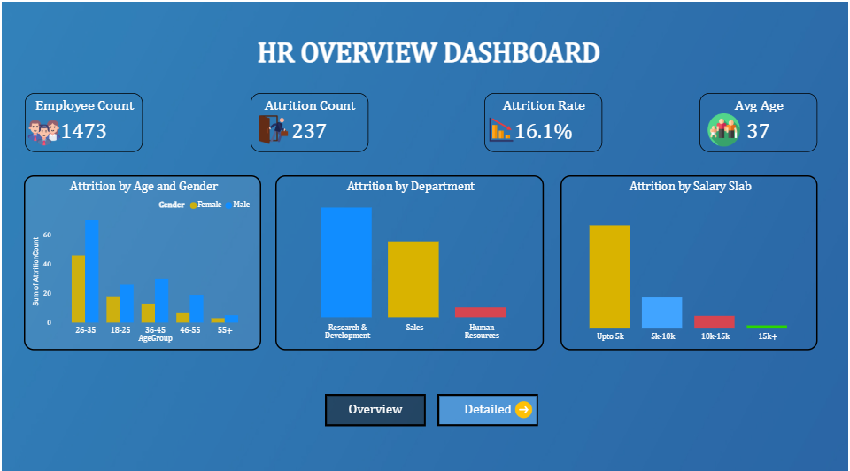
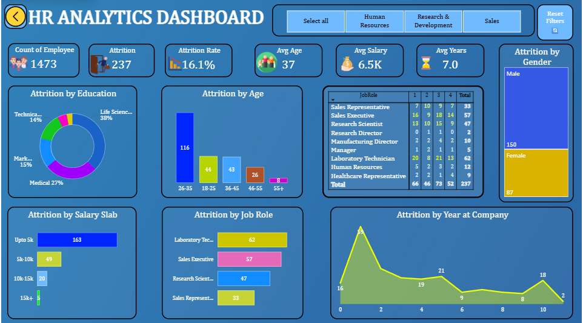

<div align="center">


<br/>


<br/>

> ### 📊 An Interactive HR Analytics Dashboard analyzing **1,473 employees** across departments, salary slabs, age groups & job roles to uncover the root causes of **16.1% employee attrition**

<br/>

[](https://tinyurl.com/hr-analytics-abhi026)
[](https://www.linkedin.com/in/abhii026/)

<br/>

### 📱 Scan to Open Live Dashboard


*Scan with your phone camera to instantly open the live Power BI dashboard*

</div>

---

## 📖 Project Overview

This project is a **Data Science Minor Project** built as part of the curriculum at **Lovely Professional University (LPU)**. It focuses on analyzing employee attrition trends using **Microsoft Power BI** to build a fully interactive, dual-page HR Analytics Dashboard.

The dashboard enables HR managers and business leaders to:

- Monitor workforce KPIs at a glance
- Explore attrition patterns across multiple dimensions
- Filter data dynamically by department
- Identify the highest-risk employee segments
- Make data-driven decisions to improve employee retention

---

## 🎯 Problem Statement

> *"The organization has an overall attrition rate of **16.1%**, with 237 out of 1,473 employees having left. What are the key factors driving this attrition, and how can they be visualized to support HR decision-making?"*

The project investigates attrition across these dimensions:
- 👤 **Demographics** — Age Group, Gender
- 💰 **Compensation** — Salary Slab
- 🏢 **Organization** — Department, Job Role
- 🎓 **Education** — Education Field
- 📅 **Tenure** — Years at Company

---

## 📊 Dashboard Preview

### 🔹 Page 1 — Overview Dashboard
> High-level KPIs + Attrition by Age & Gender, Department, and Salary Slab

| Feature | Description |
|--------|-------------|
| KPI Cards | Employee Count, Attrition Count, Rate, Avg Age |
| Chart 1 | Attrition by Age Group & Gender (Grouped Bar) |
| Chart 2 | Attrition by Department (Column Chart) |
| Chart 3 | Attrition by Salary Slab (Bar Chart) |
| Navigation | Overview ↔ Detailed page buttons |

### 🔹 Page 2 — Detailed Dashboard
> Deep-dive analysis with filters, matrix, and 7 visual types

| Feature | Description |
|--------|-------------|
| KPI Cards | + Avg Salary (6.5K), Avg Years (7.0) |
| Chart 1 | Attrition by Education (Donut Chart) |
| Chart 2 | Attrition by Age (Bar Chart) |
| Chart 3 | Attrition by Job Role (Horizontal Bar) |
| Chart 4 | Attrition by Salary Slab (Bar Chart) |
| Chart 5 | Attrition by Year at Company (Line/Area Chart) |
| Chart 6 | Attrition by Gender (Stacked Bar) |
| Matrix | Job Role × Rating Level × Attrition Count |
| Filter Panel | Department Slicer Buttons (HR / R&D / Sales) |
| Reset Button | Clears all active filters instantly |

---

## 🔑 Key Insights

```
📌 Overall Attrition Rate       →  16.1%  (237 out of 1,473 employees)
👥 Highest Attrition Age Group  →  26–35  (116 employees)
💵 Highest Attrition Salary     →  Upto 5k/month  (163 employees)
🏢 Highest Attrition Dept       →  Research & Development  (~56%)
💼 Highest Attrition Job Role   →  Laboratory Technician  (62)
🎓 Highest Attrition Education  →  Life Sciences  (38%)
♂️ Gender Attrition             →  Male: 150  |  Female: 87
📅 Peak Attrition Year          →  Year 2 at Company  (45 employees)
```

---

## 📁 Folder Structure

```
📦 HR-Analytics-Dashboard/
│
├── 📁 Dataset/
│   └── 📄 HR_Analytics_2.csv                ← Raw HR data (1,473 rows × 38 cols)
│
├── 📁 Dashboard/
│   ├── 🖼️  age-group.png                    ← KPI icon — Age Group
│   ├── 🖼️  aging.png                        ← KPI icon — Years at Company
│   ├── 🖼️  arrow.png                        ← Navigation button (forward)
│   ├── 🖼️  back.png                         ← Navigation button (back)
│   ├── 🖼️  dashboard.png                    ← Dashboard icon
│   ├── 🖼️  decrease.png                     ← Attrition trend icon
│   ├── 🖼️  division.png                     ← Department icon
│   ├── 🖼️  exit.png                         ← Attrition/Exit icon
│   ├── 🖼️  group-chat.png                   ← Employee count icon
│   ├── 🖼️  hourglass.png                    ← Avg Years KPI icon
│   ├── 🖼️  reset.png                        ← Reset filters button icon
│   └── 🖼️  salary.png                       ← Avg Salary KPI icon
│
├── 📁 Screenshots/
│   ├── 🖼️  Overview_Dashboard.png           ← Overview page screenshot
│   └── 🖼️  Detailed_Dashboard.png           ← Detailed page screenshot
│
├── 📁 Report/
│   └── 📄 HR_Analytics_Project_Report.docx  ← Full academic project report
│
├── 🖼️  hr-analytics-abhi026-qr.png          ← QR Code → Live Dashboard
├── 📄 HR_Analytics_Dashboard.pbix           ← Power BI Desktop file
├── 📄 LICENSE                               ← MIT License
└── 📄 README.md                             ← This file
```

---

## 🛠️ Tech Stack

| Tool | Purpose |
|------|---------|
| **Microsoft Power BI Desktop** | Dashboard creation, DAX measures, all visuals |
| **Microsoft Excel** | Initial data exploration & preprocessing |
| **Power Query Editor** | ETL — data cleaning & transformation (built-in Power BI) |
| **DAX (Data Analysis Expressions)** | Calculated columns & KPI measures |
| **IBM HR Analytics Dataset** | Source data — CSV, 1,473 rows × 38 columns |
| **Custom PNG Icons** | KPI card icons and navigation buttons |

---

## ⚙️ How to Run / Use the Dashboard

### ✅ Prerequisites

- [ ] **Microsoft Power BI Desktop** installed (Free) → [Download here](https://powerbi.microsoft.com/desktop/)
- [ ] **Windows 10/11** (Power BI Desktop is Windows only)
- [ ] The file: `HR_Analytics_2.csv` from the `/Dataset/` folder
- [ ] All icon PNGs from the `/Dashboard/` folder

### 🚀 Step-by-Step Setup

**Step 1 — Clone the Repository**
```bash
git clone https://github.com/abhii026/HR-Analytics-Dashboard.git
cd HR-Analytics-Dashboard
```

**Step 2 — Open the Power BI File**
```
Double-click → HR_Analytics_Dashboard.pbix
Power BI Desktop will launch automatically
```

**Step 3 — Fix Dataset Path (if needed)**
```
If you see a data source error:
1. Go to: Home → Transform Data → Data Source Settings
2. Click "Change Source"
3. Browse to HR_Analytics_2.csv on your local machine
4. Click OK → Close & Apply
```

**Step 4 — Refresh Data**
```
Home tab → Click "Refresh"
Wait for all visuals to load
```

**Step 5 — Explore the Dashboard**
```
✅ Use "Overview" and "Detailed" buttons to switch pages
✅ Click department buttons (HR / R&D / Sales) to filter
✅ Click "Reset Filters" to clear all selections
✅ Hover over any chart for detailed tooltips
```

### 🌐 View Online (No Installation Needed)

**Live Dashboard:** 👉 [https://tinyurl.com/hr-analytics-abhi026](https://tinyurl.com/hr-analytics-abhi026)

Or scan the QR code at the top of this README.

> ⚠️ A free Microsoft account may be required to view the published Power BI report.

---

## 📂 Dataset Information

| Attribute | Details |
|-----------|---------|
| **Dataset Name** | IBM HR Analytics Employee Attrition & Performance |
| **Source** | [Kaggle — IBM HR Analytics](https://www.kaggle.com/pavansubhasht/ibm-hr-analytics-attrition-dataset) |
| **Creator** | IBM Watson Analytics |
| **Total Records** | 1,473 employees |
| **Total Features** | 38 columns |
| **Target Variable** | `Attrition` (Yes / No) |
| **File Format** | CSV |
| **License** | Open / Public Domain |

### Key Columns Used

| Column | Type | Description |
|--------|------|-------------|
| `Age` | Integer | Employee age |
| `Attrition` | String | Left company? (Yes/No) |
| `Department` | String | HR / R&D / Sales |
| `Gender` | String | Male / Female |
| `JobRole` | String | Specific job title |
| `MonthlyIncome` | Integer | Monthly salary (USD) |
| `YearsAtCompany` | Integer | Total tenure |
| `EducationField` | String | Academic background |
| `AgeGroup` | Derived | Age bracket (engineered) |
| `SalarySlab` | Derived | Salary category (engineered) |

---

## 🧹 Data Preprocessing (ETL)

All preprocessing was performed in **Power Query Editor** within Power BI.

```
EXTRACT   →  Loaded HR_Analytics_2.csv into Power BI via "Get Data"

TRANSFORM →  ✅ Verified zero null/missing values across all 38 columns
             ✅ Validated and corrected all data types
             ✅ Created AgeGroup column  →  conditional bucketing of Age
             ✅ Created SalarySlab column  →  bucketing of MonthlyIncome
             ✅ Created Attrition Count  →  IF Attrition = "Yes" THEN 1 ELSE 0

LOAD      →  Clean data model loaded into Power BI report view
```

### DAX Measures Created

```dax
-- Attrition Binary Column
Attrition Count = IF([Attrition] = "Yes", 1, 0)

-- Attrition Rate KPI
Attrition Rate = DIVIDE(SUM([Attrition Count]), COUNT([EmpID]), 0)

-- Average Age KPI
Avg Age = AVERAGE([Age])

-- Average Monthly Salary KPI
Avg Salary = AVERAGE([MonthlyIncome])

-- Average Years at Company KPI
Avg Years = AVERAGE([YearsAtCompany])
```

---

## 📈 Dashboard Features

| Feature | Description |
|---------|-------------|
| 🎛️ **Interactive Filters** | Filter entire dashboard by Department (HR / R&D / Sales) |
| 🔄 **Reset Button** | One-click clears all active filters |
| 🔀 **Page Navigation** | Smooth navigation between Overview & Detailed pages |
| 🃏 **KPI Cards with Icons** | 6 custom-icon KPI cards per dashboard page |
| 📊 **7 Chart Types** | Bar, Donut, Line, Stacked, Column, Area, Matrix |
| 🎨 **Consistent Theme** | Professional dark blue color palette throughout |
| 🏷️ **Data Labels** | All charts display exact numeric values |
| 📋 **Job Role Matrix** | Cross-tab: Role × Rating Level × Attrition Count |

---

## 🌐 Power BI Publish Link

> 🔗 **Live Dashboard:** [https://tinyurl.com/hr-analytics-abhi026](https://tinyurl.com/hr-analytics-abhi026)

### How to Publish Your Own Copy

```
1. Open HR_Analytics_Dashboard.pbix in Power BI Desktop
2. Sign in with your Microsoft account
3. Click: Home → Publish → Select "My Workspace"
4. After publishing, go to app.powerbi.com
5. Open the report → File → Embed → Publish to Web
6. Copy the shareable link
```

---

## 👨‍💻 Author

<div align="center">

| | |
|---|---|
| **Name** | Abhishek Singh |
| **GitHub** | [@abhii026](https://github.com/abhii026) |
| **University** | Lovely Professional University, Phagwara |
| **Department** | Computer Science & Engineering |
| **Academic Year** | 2024–25 |

<br/>

[](https://github.com/abhii026)
[](https://www.linkedin.com/in/abhii026/)

</div>

---
## 📸 Dashboard Screenshots

### Overview Dashboard


### Detailed Dashboard



## 📜 License

```
MIT License

Copyright (c) 2025 Abhishek Singh

Permission is hereby granted, free of charge, to any person obtaining a copy
of this software and associated documentation files (the "Software"), to deal
in the Software without restriction, including without limitation the rights
to use, copy, modify, merge, publish, distribute, sublicense, and/or sell
copies of the Software, and to permit persons to whom the Software is
furnished to do so.

THE SOFTWARE IS PROVIDED "AS IS", WITHOUT WARRANTY OF ANY KIND.
```

---

## ⭐ Acknowledgements

- 🙏 **IBM Watson Analytics** — for the open HR dataset
- 🙏 **Kaggle Community** — for dataset hosting and community notebooks
- 🙏 **Microsoft Power BI Team** — for the powerful BI platform
- 🙏 **Faculty, LPU** — for project guidance and mentorship
- 🙏 **Lovely Professional University** — for the academic opportunity
